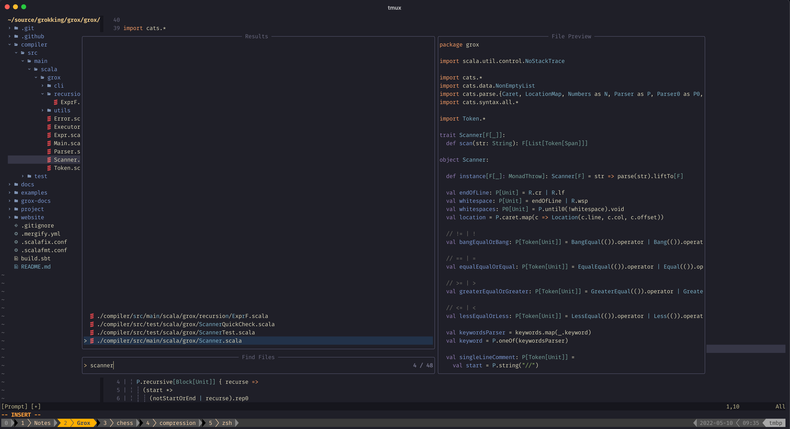

# Dotfiles

for [@lenguyenthanh](https://twitter.com/lenguyenthanh)



## Install

Just do it ¯\_(ツ)_/¯

```
curl -sSL https://raw.githubusercontent.com/lenguyenthanh/dotfiles/master/install.sh | sh
```

## Tools

- Vim/NeoVim
- Git
- Mac
- Brew
- Iterm2
- Tmux
- Zsh
- Oh-My-Zsh

## Languages

- Scala
- Haskell
- Rust
- Lua
